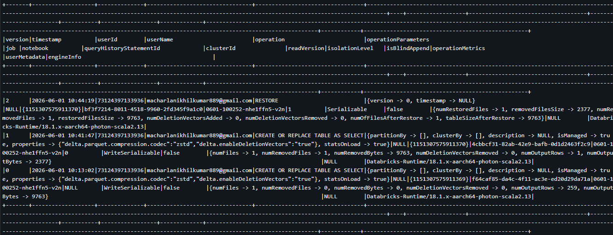
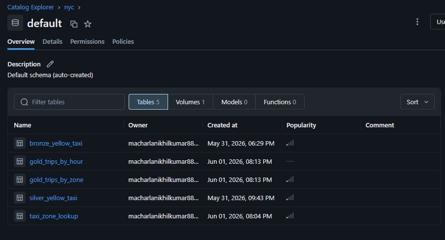

# NYC Taxi Medallion Architecture — Databricks + Delta Lake

## Overview
This project demonstrates the medallion architecture (Bronze → Silver → Gold) using PySpark 
on Databricks. It processes the NYC Yellow Taxi January 2026 dataset through three Delta 
Lake layers — raw ingestion, cleaning and enrichment, and aggregation — and includes a 
Delta time travel and RESTORE demo to simulate production incident recovery.

The Gold layer answers two operational questions: which pickup zones generate the most 
trips, and what hours of the day have the highest demand.

## Architecture
```
Raw Parquet (Volume)
      ↓
Bronze — raw Delta table, no transformations
      ↓
Silver — typed, cleaned, filtered, enriched Delta table
      ↓
Gold — aggregated Delta tables for downstream analysis
```

## Dataset
- Source: https://www.nyc.gov/site/tlc/about/tlc-trip-record-data.page
- File: `yellow_tripdata_2026-01.parquet`
- Raw row count: 3,724,889
- Zone lookup: `taxi_zone_lookup.csv` (263 NYC taxi zones)

## Medallion Layers

### Bronze
Reads raw parquet from Databricks Volumes and writes it as-is into a Delta table. 
No transformations are applied. Bronze preserves the source data exactly as received.

- Table: `nyc.default.bronze_yellow_taxi`
- Rows: 3,724,889

### Silver
Reads from Bronze. Applies type casting, column renaming to snake_case, row-level 
filtering, and derives one new column.

**Cleaning applied:**
- All columns cast to correct types (timestamps, integers, doubles)
- Original PascalCase column names renamed to snake_case

**Filters applied (1,227,953 rows removed — 33% of raw data):**
- `trip_duration_minutes between 1 and 180` — removes meter errors (< 1 min) 
  and outliers (> 3 hours)
- `trip_distance > 0` — removes trips with no recorded distance
- `fare_amount > 0` — removes zero or negative fare rows
- `passenger_count between 1 and 6` — removes trips with no passengers 
  or counts exceeding NYC taxi capacity
- `pickup_datetime >= 2026-01-01 AND < 2026-02-01` — source file contains 
  spillover rows from Dec 31 2025 and Feb 1 2026; filtered to strict January grain

**Derived column:**
- `trip_duration_minutes` — calculated as `(dropoff_datetime - pickup_datetime) / 60`, 
  rounded to 2 decimal places

- Table: `nyc.default.silver_yellow_taxi`
- Rows after filtering: 2,496,936

### Gold
Reads from Silver. Produces two aggregated Delta tables for downstream analysis.

**`gold_trips_by_zone`**
Aggregates total trips, average fare, average distance, average duration, and total 
revenue per pickup zone. Joined to `taxi_zone_lookup` to replace numeric `LocationID` 
with human-readable zone and borough names. Useful for identifying high-demand zones 
for driver allocation or surge pricing decisions.
- Rows: 259 (4 zones had zero January trips)

**`gold_trips_by_hour`**
Aggregates total trips, average fare, average distance, and average duration by hour 
of day (0–23). Useful for fleet scheduling and identifying peak demand windows.
- Rows: 24

## Delta Lake Features Demonstrated

### Time Travel and RESTORE
Simulated a production data corruption scenario on `gold_trips_by_zone`:

1. **Version 0** — original Gold write, 259 rows
2. **Version 1** — bad overwrite simulated with a single corrupted row
3. **Version 2** — table restored to Version 0 using `RESTORE TABLE ... TO VERSION AS OF 0`

This demonstrates Delta Lake's ability to recover from bad writes without rerunning 
the full pipeline.



### OPTIMIZE and VACUUM
- `OPTIMIZE` — compacts small files for faster reads. On this dataset, 
  Databricks Serverless had already written optimally — no additional 
  compaction was required, confirming efficient write behaviour.
- `VACUUM` — removes unreferenced files older than 7 days. No files 
  were eligible at time of execution as tables were recently created. 
  DRY RUN confirmed zero deletions.


## Tech Stack
- PySpark
- Databricks (Free Edition, Serverless Compute)
- Delta Lake
- Python 3

## How to Run
1. Upload `yellow_tripdata_2026-01.parquet` and `taxi_zone_lookup.csv` to 
   `/Volumes/nyc/default/nyc_raw_data/`
2. Run notebooks in order: `01_bronze_ingestion` → `02_silver_cleaning` → 
   `03_gold_aggregation` → `04_time_travel_demo`
3. Verify tables appear in the `nyc.default` schema in Databricks catalog

## Key Decisions
- **Date filter:** Source file contains spillover rows from Dec 31 2025 and Feb 1 2026. 
  Filtered to strict January 2026 to maintain a clean monthly grain and avoid 
  double-counting if adjacent month files are processed later.
- **Duration threshold (1–180 min):** Trips under 1 minute are likely meter errors. 
  Trips over 3 hours are statistical outliers inconsistent with normal NYC taxi usage.
- **Distance and fare > 0:** Zero or negative values have no operational meaning 
  and indicate data entry errors or cancelled transactions.
- **Passenger count 1–6:** NYC yellow taxis are licensed for a maximum of 6 passengers. 
  Zero passengers indicates a ghost trip or sensor error.

  